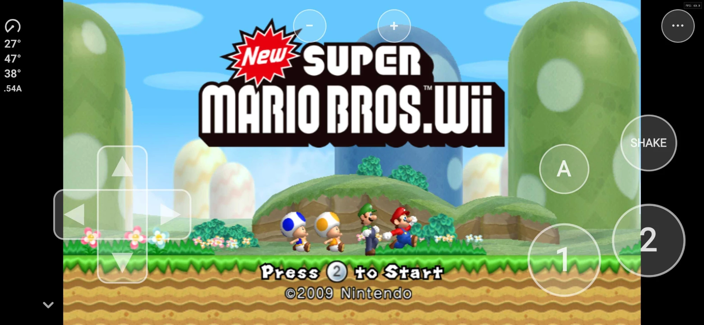
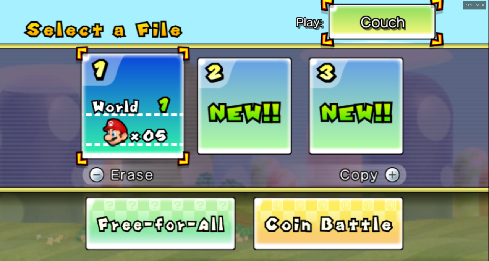

# NSMB Wii Multiplayer Decompilation

  
  

  
  
  

A native port of New Super Mario Bros. Wii for Android phones and Windows PCs, made with static
recompilation.

There's no emulator in the loop, no interpreter, no JIT, no PowerPC anywhere at runtime.

**Port made by [WitherBlitz](https://github.com/WitherBlitz) with the help of
[WiiCompiled](https://github.com/patchzyy/Wiicompiled)'s code, and was entirely coded by
Claude Opus 5.5.**

> [!IMPORTANT]
> There are no game files in this project or its releases: no disc image, no levels, music,
> graphics or sounds. You need your own copy of **New Super Mario Bros. Wii (USA, `SMNE01`,
> revision 1)** and [Dolphin](https://dolphin-emu.org/) on a computer to extract it. The downloads do
> contain the game's code, translated to native code, the way KartPad's do. See
> [What the downloads contain](#what-the-downloads-contain).

[I just want to play](#installing)

  
   Running natively on Android at 60 fps, with the on-screen sideways Wii Remote.

---

## What it does

**Runs natively on your phone.**
The whole game is compiled to ARM64 code ahead of time. It runs at a full 60 fps on a
Snapdragon 6 Gen 1 phone.

**LAN and Tailscale multiplayer across phones and PCs.**
On the save file screen, a **Couch / LAN** button sits at the top right (Couch by default). Switch it
to **LAN** to **Create Room** (choose how many are playing, then start the room when everyone is
in) or **Join** a room from a list that finds
games by itself: on your Wi-Fi, and over the internet on your [Tailscale](https://tailscale.com)
network, phones included. Every device runs the game and only the players' inputs travel, in
lockstep. If a player drops, the others get a message instead of a frozen game, and the host keeps
the progress. See [LAN and Tailscale multiplayer](#lan-and-tailscale-multiplayer).

**Tap the menus.**
On the title screen, Select a File, Select Players and the LAN menus, just tap what you want
(or click it with the mouse on Windows). The on-screen controller hides while those menus are up
and comes back for the game.

**Touch controls, tilt and shake.**
An on-screen sideways Wii Remote (D-pad, 1, 2, A, Shake, + and -) with adjustable opacity and
vibration. Turn the phone like a steering wheel to tilt, jolt it to shake. Each can be turned off.

**Any aspect ratio, ultrawide included.**
Original 4:3, 16:9, or Fill, which widens the view to fit your whole screen. On screens wider
than 16:9 (ultrawide monitors, most phones) the game really draws wider: levels, the world map and
the menus show more to the sides instead of being stretched, and enemies appear at the real edges
of your screen.

**Native rendering via aurora.**
The graphics layer is built on [aurora](https://github.com/encounter/aurora), a source-level
GameCube & Wii compatibility layer, running on Vulkan (Android) or Direct3D 12 / Vulkan (Windows).

**High internal resolution.**
Render at more than the console's 480 lines, on phones and on PC, or at exactly your screen's own
resolution with **Match Screen Resolution**.

**Settings gear.**
The gear next to the Couch / LAN button on the save file screen opens the game's settings window,
and so does the gear at the top right while the world map's **+** menu or a level's pause menu is
open (tap it, or click it on Windows).
**Video:** Match Screen Resolution, the resolution multiplier (greyed out while matching the
screen; on a wide screen each scale comes as "1x (480p)" with black bars or "1x Ultrawide" filling
the screen) and Show FPS Counter (off by default). **Keybinds:** every keyboard control, each
changed by picking it and pressing the new key, with Reset Defaults.

**In-game menus.**
On Android, the ⋯ button opens Display (aspect ratio, render resolution, FPS counter, graphics
compatibility), Controls, Leave LAN Game and Quit. On Windows, press **F10** for the settings bar.
Everything you change is saved and restored next launch.

**Skip Start Menu.**
On Android, the app can open straight into the game; the ⋯ menu's **Start Menu** brings you back.

## Tested devices

| Device | Chipset | GPU | Android | Result |
| --- | --- | --- | --- | --- |
| Samsung Galaxy S26 Ultra (SM-S948U) | Qualcomm Snapdragon 8 Elite Gen 5 for Galaxy (SM8850) | Adreno 840 | 16 | 60 fps, LAN play |
| T-Mobile REVVL 7 5G (TMRV075G) | Qualcomm Snapdragon 6 Gen 1 (SM6450) | Adreno 710 | 14 | 60 fps, LAN play |
| Windows 10 PC | AMD Ryzen 5 5600G | NVIDIA GeForce RTX 5070 | - | 60 fps, LAN play with the phones |

> [!WARNING]
> **Untested on Mali GPUs** (most phones with MediaTek, Samsung Exynos or Google Tensor chips).
> Adreno GPUs needed workarounds for their shader compilers (Display > Graphics Compatibility); Mali
> may need its own. If you try one, please open an issue with what you see.

## Requirements

- **Android:** an arm64 phone on Android 11 or newer, with Vulkan. About 1 GB free for the app,
  the game files and the import.
- **Windows:** Windows 10 or 11, 64-bit, with a Direct3D 12 or Vulkan GPU.
- Your own **USA `SMNE01` revision 1** copy of New Super Mario Bros. Wii, and Dolphin on a computer
  to extract it.

Only the USA disc, revision 1 works. Other regions and revisions put the game's code at other
addresses, so the app and the PC version check the disc and refuse anything else.

> [!NOTE]
> Nobody here will tell you where to get the game. Dumping your own disc is on you, and links to
> game files won't be provided or tolerated.

## Getting the game files

You do this once, with Dolphin on a computer:

1. In Dolphin, right-click **New Super Mario Bros. Wii** and choose **Properties**.
2. Check the **Info** tab: the game ID must be `SMNE01` and the revision **1**.
3. Open the **Filesystem** tab, right-click the disc at the top and choose **Extract Entire Disc**.
   Pick an empty folder. You get a folder with `files` and `sys` in it.

**Android:** copy that folder (or a zip of it) to your phone. Open the app and tap
**Import from Extracted Game Data Folder…** or **Import Game Data Zip…** and choose it. The app
checks the game, copies it in, and you can delete the copy afterwards. Your saves are kept when you
import again.

**Windows:** start `NSMBW.exe` and choose that folder when it asks. Or name the folder `game` and put
it next to `NSMBW.exe`. Keep the folder: the PC version reads it every time.

The app's start screen shows these steps until a game is imported, and **Help** shows them again.

## Installing

Download from the [Releases](https://github.com/WitherBlitz/NSMB-Wii-Multiplayer-Decompilation/releases/latest)
page:

- **Android:** `NSMBW-0.0.8-android-arm64.apk`. Open it on your phone and allow installing from that
  app when Android asks. Updates install over it and keep your saves and game files.
- **Windows:** `NSMBW-0.0.8-windows-x64.zip`. Extract it anywhere and run `NSMBW.exe`. Settings
  (including where your game files are), saves and caches live in `Documents\MarioWiiSaveData`, so a
  new version, extracted anywhere, carries on where the last one left off. The first start of 0.0.8
  takes over the data of an older version extracted in the same folder (or of the version it
  replaces).

> [!CAUTION]
> Only take builds from this repository's
> [Releases](https://github.com/WitherBlitz/NSMB-Wii-Multiplayer-Decompilation/releases) page. If someone's
> sharing an APK or zip anywhere else, don't touch it.

## Controls

**Android:** the on-screen remote, tilt and shake, all adjustable under ⋯ > Controls.

**Windows** (a Wii Remote held sideways):

| Key | Wii Remote |
| --- | --- |
| Arrow keys | D-pad |
| X or Space | 2 (jump) |
| Z or Left Shift | 1 (run, fireball) |
| C or Ctrl | Shake (spin, pick up) |
| Q / E | Tilt left / right |
| A | A |
| Enter or Esc | + (pause, the world map's menu) |
| Minus or Tab | - |
| F10 | Settings bar |

Every key can be changed in the gear's **Keybinds** tab on the save file screen. A game controller
also works on Windows as a sideways Wii Remote (remap it under F10 > Controls).

## LAN and Tailscale multiplayer

  
   The Couch / LAN button on the save file screen (Windows), in the game's own style. Press Up from any file to reach it.

Up to 4 players, on any mix of phones and PCs. Every player needs their own game files.

1. One player presses Up on the save file screen to reach the **Couch** button at the top right,
   switches it to **LAN**, then picks **Create Room** and how many are playing.
2. The others switch it to **LAN** too, pick **Join**, and choose the room from the list.
3. The host starts the room. Every device restarts into the session with the host's save, and the
   game goes to the player select by itself.

**Same Wi-Fi:** rooms show up by themselves.

**Over the internet, with Tailscale:** install [Tailscale](https://tailscale.com) on every device
and sign in to the same tailnet (or [share a device](https://tailscale.com/kb/1084/sharing) with
friends). Tailscale can't broadcast, so the game finds rooms there like this:

- A **PC** asks every device in `tailscale status`, and a PC's room is announced to every Tailscale
  device, so it shows up on the phones by themselves.
- Devices **remember** the Tailscale devices they meet (on the same Wi-Fi or over Tailscale) and
  **pass them on**: once any device has seen another, every game device on the tailnet learns it.
- To find another **phone** the very first time with no PC around, add its Tailscale name (as shown
  in the Tailscale app, e.g. `s26-ultra`) or its 100.x address under **Tailscale & LAN Devices**:
  on the start menu or the in-game ⋯ menu on Android, or **F10 > LAN Play** on Windows. Those
  screens also show the device's own addresses to tell others. Only one of the two needs to add the
  other.

Rooms on the same Wi-Fi are always used over the Wi-Fi, even when Tailscale is on. Tailscale play
was tested between the Windows PC and the REVVL 7 over Tailscale alone, in both directions.

Windows asks to let the game through the firewall the first time you host a room; allow it, or
others can't find your room. **Couch** is the normal local multiplayer on one device.

## Building from source

Owning the game is still required even if you compile everything yourself.

You'll need: .NET 8 SDK, CMake, Ninja, LLVM/Clang (LLVM-MinGW for Windows, the Android NDK for
Android) and Python 3. The full steps, from Dolphin's extraction to the APK and the exe, are in
[`projects/nsmbw/BUILDING.md`](projects/nsmbw/BUILDING.md).

- The NSMBW project: [`projects/nsmbw`](projects/nsmbw) (translator config, function map, tools).
- The runtime, retargeted from Mario Kart Wii to NSMBW: [`runtime`](runtime).
- The Android app: [`android`](android).
- WiiCompiled's own README, for the translator and the runtime it comes from:
  [`docs/WiiCompiled-README.md`](docs/WiiCompiled-README.md).

## What the downloads contain

The release downloads include the game's code, translated from the disc's PowerPC executable to
native ARM64 and x86-64 code, but no game files: no disc image, no levels, music, graphics or
sounds, and no console keys. You supply those from your own disc. This is the same model KartPad
uses for Mario Kart Wii. WiiCompiled itself does not ship translated code: its setup translates the
game on your own machine.

The source code in this repository is free software under the GPLv3 (see [License](#license)).
That license covers this project's code only; it gives no rights to Nintendo's game, its code or
its assets.

## FAQ

**Is this an emulator?**
No. Everything is compiled to native code before you ever press play. At runtime there's nothing
emulating a Wii CPU or GPU.

**Is it a decompilation?**
Not in the hand-written sense: it's a static recompilation. WiiCompiled's translator turns the
game's PowerPC code into C++ automatically, and that is compiled for your phone or PC. The runtime
around it (graphics, audio, input, the Wii's system software) is source code.

**Do you provide the game?**
No. Don't ask.

**Which game version works?**
USA `SMNE01`, revision 1. Other regions and revisions are **rejected**: their code sits at other
addresses, and this port's runtime hooks the game at exact addresses.

**Will you fix original bugs?**
No, behaving like the real game is the goal. Only report things where this port differs from the
original game on a Wii or in Dolphin.

**The game crashed or shows something wrong.**
Open an issue with your device, what you did, and (on Windows) the log from
`Documents\MarioWiiSaveData\Logs`.

**Is it done?**
No, this is 0.0.8. It boots and plays on the tested devices, but not every level has been checked,
and rendering, performance and LAN play are still being worked on.

## AI usage

This port was entirely coded by Claude Opus 5.5, Anthropic's AI model, directed and tested by
WitherBlitz on the devices above. That includes moving WiiCompiled's runtime from Mario Kart Wii to
New Super Mario Bros. Wii, the Android app, and LAN play.

## Credits

- **[WiiCompiled](https://github.com/patchzyy/Wiicompiled)** by patchzyy and contributors - the
  static recompiler and runtime this port is built on.
- **[KartPad](https://github.com/chrissotraidis/kartpad)** - WiiCompiled on Android, whose approach
  and game-file import steps this port follows.
- **[aurora](https://github.com/encounter/aurora)** - the GX rendering/windowing backend. MIT
  licensed.
- **[Dawn](https://dawn.googlesource.com/dawn)** - Google's WebGPU implementation, powering aurora's
  Vulkan and Direct3D backends.
- **[Dolphin Emulator](https://github.com/dolphin-emu/dolphin)** - the reference for Wii hardware
  behavior, the free DSP coefficient ROM and the default WiiConnect24 tree bundled with the runtime,
  and the tool you extract your game with.
- **The NSMBW reverse-engineering community** - RootCubed's
  [NSMBW symbols](https://github.com/RootCubed/nsmbw-symbols), the NSMBW decompilation and the
  NSMBW address maps, which the function map is built from.
- Everyone in the static recompilation community.

Bundled third-party components and their licenses live in
[`THIRD-PARTY-NOTICES.md`](THIRD-PARTY-NOTICES.md).

## License

This project is free software: you can redistribute it and/or modify it under the terms of the
[GNU General Public License, version 3](LICENSE) as published by the Free Software Foundation, like
WiiCompiled, which it is based on.

It is distributed in the hope that it will be useful, but WITHOUT ANY WARRANTY; without even the
implied warranty of MERCHANTABILITY or FITNESS FOR A PARTICULAR PURPOSE. See the GNU General Public
License for more details.

Not affiliated with, endorsed by, or associated with Nintendo. New Super Mario Bros. Wii is a
trademark of Nintendo.
